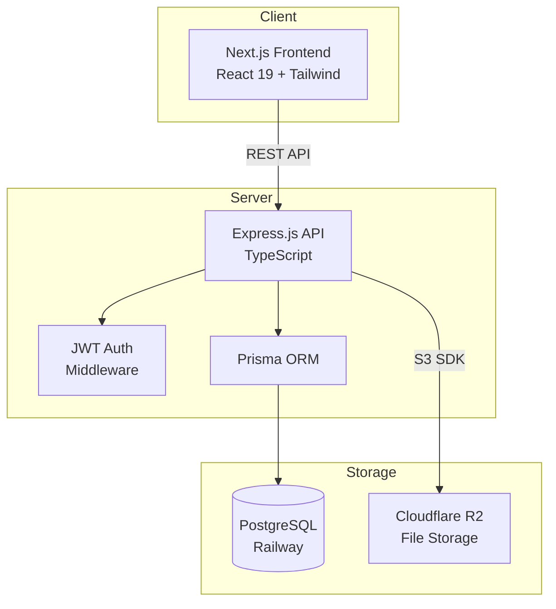
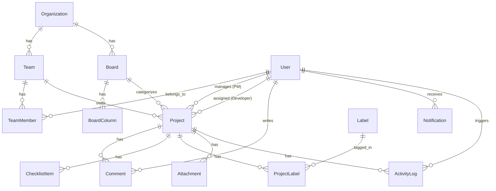

# Architecture — ProManage

## System Overview



## Data Model



### Core Entities

| Entity         | Purpose                                                       |
| -------------- | ------------------------------------------------------------- |
| Organization   | Top-level tenant (single org currently)                       |
| Team           | Sales team — scopes project visibility                        |
| Board          | Service category (Logo, Web Design, Web Dev, Content)         |
| BoardColumn    | Workflow stage per board (dynamic, not hardcoded)              |
| User           | Employee with one of 4 roles (TL, PM, Production, Executive) |
| TeamMember     | Many-to-many link between Users and Teams                     |
| Project        | Core work item — belongs to a Board + Team                    |
| Comment        | Text comment on a project                                     |
| ChecklistItem  | Toggleable task within a project                              |
| Label          | Reusable tag (many-to-many with projects)                     |
| Attachment     | File uploaded to R2, linked to a project                      |
| Notification   | In-app notification for a user                                |
| ActivityLog    | Audit trail of actions on projects                            |

### Key Relationships

- `Project.status` → string that references `BoardColumn.key` (not a fixed enum)
- `Project.boardId` → which service board (Logo Design, etc.)
- `Project.teamId` → which sales team owns the project
- `Project.pmId` → assigned Project Manager
- `Project.developerId` → assigned Production team member (optional)

## Role-Based Access Control

```
TL (Team Lead)
├── Can see all projects in their team
├── Can create/edit/delete projects
└── Oversees PMs in their team

PM (Project Manager)
├── Can see projects in their team
├── Can create/edit projects they manage
└── Assigned as project manager

PRODUCTION
├── Can see ALL projects across ALL teams  ← cross-team visibility
├── Assigned as developer on projects
└── Execution-focused role

EXECUTIVE
├── Can view projects (read-only)
└── High-level dashboards and stats
```

## Request Flow

```
1. Client sends request with JWT in Authorization header
2. auth.middleware.ts → authenticate() verifies token, attaches req.user
3. auth.middleware.ts → authorizeRoles() checks role permissions
4. Controller handles business logic
5. Prisma queries PostgreSQL
6. Response: { success, message, data }
```

## Frontend Architecture

```
App Router (Next.js)
├── / → Login page
├── /dashboard → Main dashboard
│   ├── Workspace stat cards (4 boards)
│   ├── Recent projects
│   └── Quick stats
├── /dashboard/[workspace] → Kanban board
│   ├── Dynamic columns from BoardColumn
│   ├── Draggable project cards (@dnd-kit)
│   └── Project modal (view/edit)
└── /dashboard/my-work → User's assignments

State: AppContext (React Context)
├── Auth (user, token)
├── Projects, Teams, Boards
├── Notifications
└── UI state (loading, errors)
```

## Deployment

- **Backend**: Railway (Node.js service)
- **Database**: Railway (PostgreSQL addon)
- **Frontend**: Railway (Next.js service)
- **File Storage**: Cloudflare R2 (S3-compatible bucket)

## Future Architecture (CRM Modules)

The system is designed to expand with new modules:

```
Current:
  └── Project Management (Kanban boards, teams, roles)

Planned:
  ├── HR Module (salary calculation, attendance)
  ├── Sales Module (invoicing, Stripe, client management)
  └── Finance Module (payment tracking, reports)
```

Each module will share the existing Organization → Team → User hierarchy and auth system.
